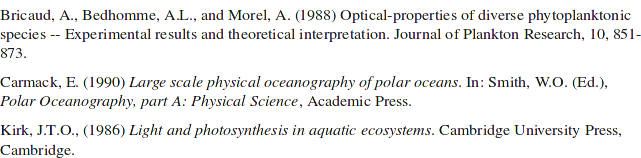
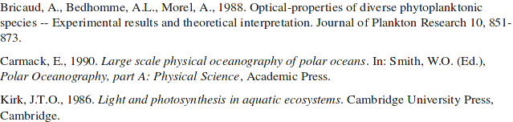
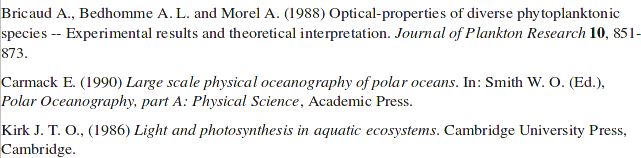
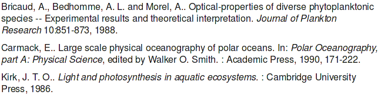
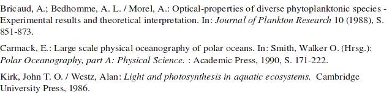
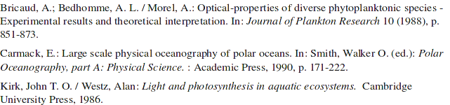

# OpenOffice style files for JabRef

This repository contains jstyle files used for OpenOffice integration in JabRef.
It uses the format of the [Custom Export Filters](http://help.jabref.org/en/CustomExports).
One can use the [
Export-Filter Editor for Jabref](https://github.com/teertinker/Export-Filter-Editor) to quickly create his own export filter.
For more information, see <https://help.jabref.org/en/OpenOfficeIntegration>.

To use the styles below, make sure to download the linked `.jstyle` files directly to disk rather than copy-pasting the contents from your browser.

The custom export format of JabRef is an alternative to the [Citation Style Language](http://citationstyles.org/), which is an XML-based format to describe bibliographic rendering.

## Table of Contents

<!-- generated by https://github.com/jonschlinkert/markdown-toc using markdown-toc -i README.md -->

<!-- toc -->

- [Available Styles](#available-styles)
  * [Brazilian Journal of Aquatic Science and Technology](#brazilian-journal-of-aquatic-science-and-technology)
  * [Advanced Materials](#advanced-materials)
  * [American Journal of Hematology](#american-journal-of-hematology)
  * [American Mineralogist](#american-mineralogist)
  * [Annals of Hematology](#annals-of-hematology)
  * [Blood](#blood)
  * [British Journal of Haematology](#british-journal-of-haematology)
  * [Chemical Geology](#chemical-geology)
  * [Geochim. Cosmochim. Acta](#geochim-cosmochim-acta)
  * [Haematologica](#haematologica)
  * [Hematological Oncology](#hematological-oncology)
  * [Journal of Hematology and Oncology](#journal-of-hematology-and-oncology)
  * [Journal of Materials Chemistry](#journal-of-materials-chemistry)
  * [Journal of Neurophysiology](#journal-of-neurophysiology)
  * [Leukemia](#leukemia)
  * [Remote Sensing of Environment.](#remote-sensing-of-environment)
  * [Turabian (Deutsch)](#turabian-deutsch)
  * [Turabian (English)](#turabian-english)
  * [Vancouver Style (Deutsch)](#vancouver-style-deutsch)
  * [Vancouver Style (English)](#vancouver-style-english)
- [Example Styles](#example-styles)
  * [Example style file](#example-style-file)
  * ["Thesis", example style with numbered citations](#thesis-example-style-with-numbered-citations)
- [License](#license)

<!-- tocstop -->

## Available Styles

### Brazilian Journal of Aquatic Science and Technology

- Author: Colin Beasley
- File: [BJAST.jstyle](BJAST.jstyle)

### Advanced Materials

- Author: Steffan Cook
- File: [Adv_Mater.jstyle](Adv_Mater.jstyle)

### American Journal of Hematology

- Author: Katrina Vanura
- File: [AmJHematol.jstyle](AmJHematol.jstyle)

### American Mineralogist

- Author: Jan Stelling
- File: [American_Mineralogist.jstyle](American_Mineralogist.jstyle)
- 

### Annals of Hematology

- Author: Katrina Vanura
- File: [AnnHematol.jstyle](AnnHematol.jstyle)

### Chemical Geology

- Author: Jan Stelling
- File: [Chemical_Geology.jstyle](Chemical_Geology.jstyle)
- 

### Blood

- Author: Katrina Vanura
- File: [Blood.jstyle](Blood.jstyle)

### British Journal of Haematology

- Author: Katrina Vanura
- File: [BrJHaematol.jstyle](BrJHaematol.jstyle)

### Geochim. Cosmochim. Acta

- Author: Jan Stelling
- File: [Geochim_Cosmochim_Acta.jstyle](Geochim_Cosmochim_Acta.jstyle)
- 

### Haematologica

- Author: Katrina Vanura
- File: [Haematologica.jstyle](Haematologica.jstyle)

### Hematological Oncology

- Author: Katrina Vanura
- File: [HematolOncol.jstyle](HematolOncol.jstyle)

### Journal of Hematology and Oncology

- Author: Katrina Vanura
- File: [JHematolOncol.jstyle](JHematolOncol.jstyle)

### Journal of Materials Chemistry

- Author: Steffan Cook
- File: [J_of_Mater_Chem.jstyle](J_of_Mater_Chem.jstyle)

### Journal of Neurophysiology

- Author: Ted Carnevale
- File: [J_of_Neurophysiology.jstyle](J_of_Neurophysiology.jstyle)
- 

### Leukemia

- Author: Katrina Vanura
- File: [Leukemia.jstyle](Leukemia.jstyle)

### Remote Sensing of Environment.

This follows [Elsevier's guidelines for authors](https://www.elsevier.com/journals/remote-sensing-of-environment/0034-4257/guide-for-authors#21000).

- Author: Florian Detsch
- File: [remoteSensingOfEnvironment.jstyle](remoteSensingOfEnvironment.jstyle)

### Turabian (Deutsch)

- Author: Uwe Jochum
- File: [turabian-deutsch.jstyle](turabian-deutsch.jstyle)
- 

### Turabian (English)

- Author: Uwe Jochum
- File: [turabian-english.jstyle](turabian-english.jstyle)
- 

### Vancouver Style (Deutsch)

Vancouver-Style wie hier beschrieben: https://guides.lib.monash.edu/ld.php?content_id=48260115 . (icht alle bibtex-Entitäten sind implementiert)

- Author: Eike Kühn
- File: [Vancouver_Deutsch.jstyle](Vancouver_Deutsch.jstyle)

### Vancouver Style (English)

Vancouver style as described here: https://guides.lib.monash.edu/ld.php?content_id=48260115 . (not all bibtex entities implemented)

- Author: Eike Kühn
- File: [Vancouver_English.jstyle](Vancouver_English.jstyle)

## Example Styles

### Example style file

- File: [example_style_file.jstyle](example_style_file.jstyle)

### "Thesis", example style with numbered citations

- Author: Seppo Enarvi
- File: [Thesis_Number_Style.jstyle](Thesis_Number_Style.jstyle)

## License

The files are subject to the [CC BY 4.0](https://creativecommons.org/licenses/by/4.0/) if not otherwise noted.

Some files are subject under the terms of the GPL version 2 (or later).
